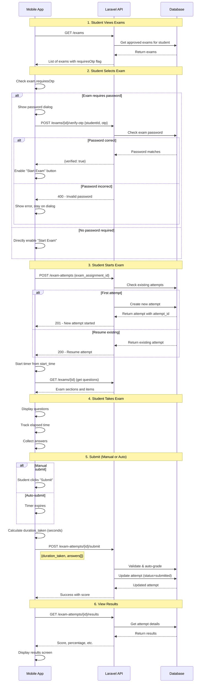

# Mobile App API Reference - Exam Attempts

This document provides the complete API specification for exam attempt functionality for mobile app developers.

---

## Base URL
```
http://127.0.0.1:8000/api
```

## Authentication
All exam attempt endpoints require authentication using Laravel Sanctum bearer token.

**Header:**
```
Authorization: Bearer {token}
```

---

## 📋 Exam Attempt Endpoints

### 1. Verify Exam Password (OTP)

**Endpoint:** `POST /exams/{examId}/verify-otp`

**Description:** Verifies the exam password before allowing the student to start the attempt. Must be called first if the exam requires a password.

**URL Parameters:**
- `{examId}` - The exam ID from the exam list

**Request Body:**
```json
{
  "studentId": 789,
  "otp": "EXAM2025"
}
```

**Request Fields:**
| Field | Type | Required | Description |
|-------|------|----------|-------------|
| `studentId` | integer | ✅ Yes | The authenticated student's user ID |
| `otp` | string | ✅ Yes | The exam password provided by the instructor |

**Success Response (200 OK - Password Correct):**
```json
{
  "verified": true,
  "message": "Password verified successfully"
}
```

**Success Response (200 OK - No Password Required):**
```json
{
  "verified": true,
  "message": "No password required for this exam"
}
```

**Error Responses:**

| Status | Message | Reason |
|--------|---------|--------|
| 400 | "Invalid exam password" | Wrong password entered |
| 403 | "Student ID mismatch" | studentId doesn't match authenticated user |
| 404 | "Exam not found or not available" | Exam doesn't exist or not approved |

**Mobile App Behavior:**
1. Check `exam.requiresOtp` from exam list
2. If `true`, show password dialog before allowing exam start
3. Call this endpoint with entered password
4. If `verified: true`, proceed to start attempt
5. If `verified: false`, show error and prevent exam access

---

### 2. Start Exam Attempt

**Endpoint:** `POST /exam-attempts`

**Description:** Creates a new exam attempt or returns an existing in-progress attempt. Prevents students from retaking completed exams.

**Request Body:**
```json
{
  "exam_assignment_id": 123
}
```

**Request Fields:**
| Field | Type | Required | Description |
|-------|------|----------|-------------|
| `exam_assignment_id` | integer | ✅ Yes | The assignment ID from the exam list |

**Success Response (201 Created - New Attempt):**
```json
{
  "attempt": {
    "attempt_id": 456,
    "exam_assignment_id": 123,
    "student_id": 789,
    "start_time": "2025-10-24T09:00:00.000000Z",
    "status": "in_progress"
  },
  "message": "Exam attempt started successfully"
}
```

**Success Response (200 OK - Resuming Existing):**
```json
{
  "attempt": {
    "attempt_id": 456,
    "exam_assignment_id": 123,
    "student_id": 789,
    "start_time": "2025-10-24T09:00:00.000000Z",
    "status": "in_progress"
  },
  "message": "Resuming existing attempt"
}
```

**Error Responses:**

| Status | Message | Reason |
|--------|---------|--------|
| 400 | "You have already completed this exam" | Student already submitted this exam |
| 400 | "Exam has not started yet" | Current time before `schedule_start` |
| 400 | "Exam has ended" | Current time after `schedule_end` |
| 403 | "You do not have access to this exam" | Student not enrolled in the class |
| 404 | "Exam not found or not available" | Exam not approved or doesn't exist |

**Mobile App Behavior:**
1. **ONLY call this AFTER password verification (if required)**
2. Call this endpoint when student clicks "Start Exam" (after password verified)
3. If status 201, start fresh timer from 0
4. If status 200 (resuming), calculate elapsed time from `start_time`
5. Store `attempt_id` for later submission
6. If error 400 "already completed", show "Already taken" message

---

### 3. Submit Exam Attempt

**Endpoint:** `POST /exam-attempts/{attemptId}/submit`

**Description:** Submits student's answers for grading. Accepts both manual and auto-submissions (when time expires).

**URL Parameters:**
- `{attemptId}` - The attempt ID from start attempt response

**Request Body:**
```json
{
  "duration_taken": 3540,
  "answers": [
    {
      "item_id": 101,
      "answer": "1"
    },
    {
      "item_id": 102,
      "answer": "Paris"
    },
    {
      "item_id": 103,
      "answer": ["apple", "banana", "cherry"]
    }
  ]
}
```

**Request Fields:**
| Field | Type | Required | Description |
|-------|------|----------|-------------|
| `duration_taken` | integer | ✅ Yes | Total time taken in **SECONDS** |
| `answers` | array | ✅ Yes | Array of answer objects |
| `answers[].item_id` | integer | ✅ Yes | Question item ID |
| `answers[].answer` | mixed | ✅ Yes | Student's answer (string, integer, or array) |

**Answer Format by Question Type:**

| Question Type | Answer Format | Example |
|---------------|---------------|---------|
| Multiple Choice (mcq) | String (option index) | `"1"` or `"2"` |
| True/False (torf) | String | `"true"` or `"false"` |
| Identification (iden) | String | `"Paris"` |
| Enumeration (enum) | Array of strings | `["apple", "banana", "cherry"]` |
| Essay (essay) | String | `"This is my essay answer..."` |

**Success Response (200 OK - Within Time):**
```json
{
  "message": "Exam submitted successfully",
  "attempt": {
    "attempt_id": 456,
    "start_time": "2025-10-24T09:00:00.000000Z",
    "end_time": "2025-10-24T09:59:00.000000Z",
    "score": 85,
    "status": "submitted"
  }
}
```

**Success Response (200 OK - Auto-Submit):**
```json
{
  "message": "Exam auto-submitted due to time limit",
  "attempt": {
    "attempt_id": 456,
    "start_time": "2025-10-24T09:00:00.000000Z",
    "end_time": "2025-10-24T10:00:30.000000Z",
    "score": 70,
    "status": "submitted"
  }
}
```

**Error Responses:**

| Status | Message | Reason |
|--------|---------|--------|
| 400 | "Exam already submitted" | Attempt was already submitted |
| 403 | "Unauthorized" | Attempt doesn't belong to this student |
| 404 | "Exam attempt not found" | Invalid attempt ID |

**Mobile App Behavior:**

**Manual Submit (within time):**
1. Calculate total elapsed seconds from `start_time`
2. Send `duration_taken` with all answers
3. Show success message from response

**Auto-Submit (time expired):**
1. When timer reaches 0, automatically call this endpoint
2. Send `duration_taken` = `exam.duration * 60` (or actual elapsed time)
3. Include all answers collected so far (even if incomplete)
4. API will accept and grade whatever was submitted
5. Response will say "auto-submitted due to time limit"

**Duration Calculation Example:**
```dart
// When starting exam
DateTime startTime = DateTime.parse(attempt.start_time);

// When submitting
DateTime now = DateTime.now();
int durationTakenSeconds = now.difference(startTime).inSeconds;

// Submit
submitAttempt(attemptId, answers, durationTakenSeconds);
```

---

### 4. Get Exam Results

**Endpoint:** `GET /exam-attempts/{attemptId}/results`

**Description:** Retrieves the results of a submitted exam attempt.

**URL Parameters:**
- `{attemptId}` - The attempt ID

**Success Response (200 OK):**
```json
{
  "attempt": {
    "attempt_id": 456,
    "start_time": "2025-10-24T09:00:00.000000Z",
    "end_time": "2025-10-24T09:59:00.000000Z",
    "score": 85,
    "total_points": 100,
    "percentage": 85.0,
    "status": "submitted"
  },
  "exam": {
    "exam_id": 12,
    "title": "Midterm Exam - Programming Fundamentals",
    "subject": {
      "code": "CS101",
      "name": "Programming Fundamentals"
    }
  },
  "answers": [
    {
      "item_id": 1,
      "question": "What is the capital of France?",
      "item_type": "mcq",
      "student_answer": "Paris",
      "correct_answer": "Paris",
      "is_correct": true,
      "points_awarded": 5,
      "points_earned": 5
    },
    {
      "item_id": 2,
      "question": "Explain Object-Oriented Programming",
      "item_type": "essay",
      "student_answer": "OOP is a programming paradigm...",
      "correct_answer": null,
      "is_correct": null,
      "points_awarded": 10,
      "points_earned": 0
    }
  ]
}
```

**Note:** The `answers` array includes all submitted answers with grading details. Essay questions show `is_correct: null` as they require manual grading.

**Error Responses:**

| Status | Message | Reason |
|--------|---------|--------|
| 400 | "Exam not yet submitted" | Attempt is still in progress |
| 403 | "Unauthorized" | Attempt doesn't belong to this student |
| 404 | "Exam attempt not found" | Invalid attempt ID |

**Mobile App Behavior:**
1. Call after successful submission
2. Display score, percentage, and exam details
3. Show in results/history screen

---

## 🔄 Complete Exam Flow



---

## ⚠️ Important Notes for Mobile App Developer

### Exam Access Flow
1. **Check Password Requirement**: Use `exam.requiresOtp` from exam list
2. **Verify Password First**: If `requiresOtp: true`, call `/exams/{id}/verify-otp` BEFORE starting attempt
3. **Start Attempt**: Only after password verified (or if no password required)
4. **Get Questions**: After attempt started, fetch exam details with `/exams/{id}`

### Timer Management
- **START**: When you receive `start_time` from start attempt API
- **CALCULATE**: Current elapsed time = `now - start_time`
- **DURATION**: Exam duration is in `exam.duration` (minutes) or `exam.duration_seconds` (seconds)
- **AUTO-SUBMIT**: When elapsed time ≥ duration, automatically submit with current answers

### Duration Tracking
- Track time on client side in **seconds**
- Send `duration_taken` in **seconds** when submitting
- API receives exam duration in **minutes** but converts to seconds for validation
- If time exceeded, API still accepts but logs it and returns different message

### Answer Storage
- Store answers locally as student progresses
- On auto-submit, send all collected answers (even if some are incomplete)
- Missing answers won't crash - API will just not award points for them

### Error Handling
- **Already completed**: Don't allow re-entry to exam
- **Not started yet**: Show countdown to exam start time
- **Already ended**: Show "Exam has closed" message
- **Connection issues**: Save answers locally, retry submission

### Validation Before Submit
```dart
// Recommended client-side checks
bool canSubmit(Attempt attempt) {
  if (attempt.status == 'submitted') {
    return false; // Already submitted
  }
  
  if (answers.isEmpty) {
    showWarning('No answers collected');
    return true; // Still allow submission
  }
  
  return true;
}
```

### Password Verification UI Flow
```dart
// Recommended UI flow for password-protected exams
Future<void> accessExam(Exam exam) async {
  // Check if password required
  if (exam.requiresOtp) {
    // Show password dialog
    String? password = await showPasswordDialog();
    
    if (password == null) {
      return; // User cancelled
    }
    
    // Verify password
    var result = await apiService.verifyExamPassword(
      exam.exam_id, 
      studentId, 
      password
    );
    
    if (!result.verified) {
      showError('Invalid exam password');
      return; // Don't proceed
    }
  }
  
  // Password verified or not required - start exam
  await startExamAttempt(exam.assignment_id);
}
```

---

## 🧪 Testing Examples

### Test Case 1: Password-Protected Exam
1. Get exam list → Check `requiresOtp: true`
2. Verify password → `POST /exams/{id}/verify-otp` with correct password
3. ✅ Should return `{verified: true}`
4. Start attempt → `POST /exam-attempts`
5. ✅ Should return attempt with `attempt_id`

### Test Case 2: Wrong Password
1. Get exam list → Check `requiresOtp: true`
2. Verify password → `POST /exams/{id}/verify-otp` with wrong password
3. ❌ Should return 400 "Invalid exam password"
4. Should NOT proceed to start attempt

### Test Case 3: No Password Required
1. Get exam list → Check `requiresOtp: false`
2. Skip password verification
3. Start attempt directly → `POST /exam-attempts`
4. ✅ Should return attempt with `attempt_id`

### Test Case 4: Normal Flow
1. (After password verified if needed)
2. Start attempt → Get `attempt_id` and `start_time`
3. Wait 30 minutes (for 60 min exam)
4. Submit with `duration_taken: 1800` (30 min * 60)
5. ✅ Should return "Exam submitted successfully"

### Test Case 5: Auto-Submit
1. (After password verified if needed)
2. Start attempt → Get `attempt_id`
3. Wait 61 minutes (for 60 min exam)
4. Submit with `duration_taken: 3660` (61 min * 60)
5. ✅ Should return "Exam auto-submitted due to time limit"

### Test Case 6: Already Completed
1. Complete an exam successfully
2. Try to start same exam again
3. ❌ Should return 400 "You have already completed this exam"

### Test Case 7: Resume Attempt
1. Start exam
2. Close app
3. Open app and start same exam again
4. ✅ Should return 200 with existing `attempt_id` and "Resuming existing attempt"

---

## 📞 Support

If you need clarification or encounter issues:
1. Check Laravel logs: `storage/logs/laravel.log`
2. All exam attempt operations are logged with DEBUG/INFO/WARNING levels
3. Search logs for: `"API Submit Attempt"`, `"API Get Exams"`, etc.

---

**Last Updated:** October 24, 2025
**API Version:** 1.0
**Compatible with:** Flutter Mobile App
